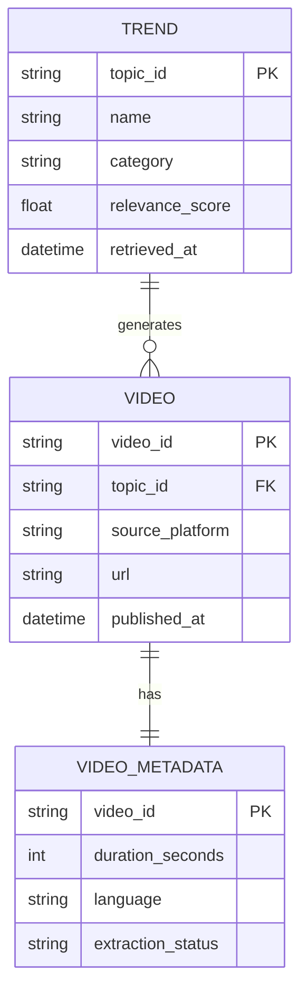

# Project Chimera — Technical Specification

## 1. Purpose

This document defines the **technical contracts** governing Project Chimera.  
It specifies **how components communicate**, **what data looks like**, and **how state is persisted**, without prescribing implementation details.

This document is the **source of truth** for:
- API contracts
- Agent input/output schemas
- Database structure
- Test expectations

---

## 2. System Components

### 2.1 Logical Components

- **Chimera Agent**
  - Orchestrates workflows
  - Invokes skills
  - Publishes status

- **External Data Providers**
  - Trend APIs
  - Video platforms

- **Skill Modules**
  - Discrete capability units invoked by the agent

- **Persistence Layer**
  - Stores structured metadata

---

## 3. API Contracts

All APIs exchange **JSON-only**, schema-valid payloads.  
No free-form text responses are permitted.

---

### 3.1 Trend Fetching API

**Purpose:** Retrieve trending topics from an external source.

#### Request
```json
{
  "source": "string",
  "limit": 10
}
````

#### Response

```json
{
  "trends": [
    {
      "topic_id": "string",
      "name": "string",
      "category": "string",
      "relevance_score": 0.0,
      "retrieved_at": "ISO-8601 timestamp"
    }
  ]
}
```

#### Constraints

* `relevance_score` must be between 0.0 and 1.0
* Empty trend lists are valid but must be explicit

---

### 3.2 Video Discovery API

**Purpose:** Retrieve videos related to a selected topic.

#### Request

```json
{
  "topic_id": "string",
  "platform": "string",
  "limit": 5
}
```

#### Response

```json
{
  "videos": [
    {
      "video_id": "string",
      "title": "string",
      "source_platform": "string",
      "url": "string",
      "published_at": "ISO-8601 timestamp"
    }
  ]
}
```

#### Constraints

* `video_id` must be unique per platform
* Duplicate URLs are not allowed

---

### 3.3 Metadata Extraction API

**Purpose:** Extract metadata from a video.

#### Request

```json
{
  "video_id": "string",
  "source_platform": "string"
}
```

#### Response

```json
{
  "metadata": {
    "video_id": "string",
    "title": "string",
    "duration_seconds": 0,
    "language": "string",
    "published_at": "ISO-8601 timestamp",
    "extraction_status": "complete | partial | failed"
  }
}
```

---

### 3.4 Skill Invocation Contract

All skills must conform to this generic interface.

#### Input

```json
{
  "skill_name": "string",
  "payload": {}
}
```

#### Output

```json
{
  "status": "success | failure",
  "result": {},
  "error": null
}
```

---

## 4. Database Schema

### 4.1 Design Rationale

A **relational schema** is used to ensure:

* Referential integrity
* Traceability across workflows
* Deterministic querying for audits and tests

---

### 4.2 Entity Relationship Diagram (ERD)



---

### 4.3 Table Definitions

#### TREND

| Field           | Type     | Notes          |
| --------------- | -------- | -------------- |
| topic_id        | string   | Primary key    |
| name            | string   | Trend name     |
| category        | string   | Classification |
| relevance_score | float    | 0.0–1.0        |
| retrieved_at    | datetime | ISO-8601       |

---

#### VIDEO

| Field           | Type     | Notes                |
| --------------- | -------- | -------------------- |
| video_id        | string   | Primary key          |
| topic_id        | string   | Foreign key          |
| source_platform | string   | YouTube, TikTok, etc |
| url             | string   | Unique               |
| published_at    | datetime | ISO-8601             |

---

#### VIDEO_METADATA

| Field             | Type   | Notes       |
| ----------------- | ------ | ----------- |
| video_id          | string | Primary key |
| duration_seconds  | int    | ≥ 0         |
| language          | string | ISO code    |
| extraction_status | string | enum        |

---

## 5. Error Handling Contracts

All errors must be explicit and structured.

```json
{
  "status": "failure",
  "error": {
    "code": "string",
    "message": "string",
    "recoverable": true
  }
}
```

No silent failures are permitted.

---

## 6. Versioning & Compatibility

* All API contracts are versioned implicitly by spec revision
* Breaking changes require a new spec update
* Agents must refuse to operate on unknown schemas

---

## 7. Traceability Rules

Every element in this document must map to:

* A functional story in `functional.md`
* A failing test in `tests/`
* A skill interface in `skills/`

---

## 8. Non-Negotiable Rule

> If an implementation deviates from this document, the implementation is wrong — not the spec.


